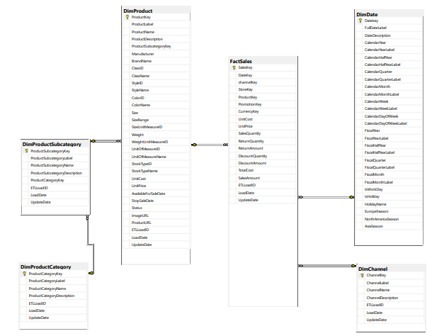

# Machine Learning com Python e T-SQL!
Projeto de ciência de dados para a modelagem de uma base de dados grande, retirada de um banco de dados relacional com consultas em T-SQL.

## Problema de negócio a ser solucionado

A empresa Contoso trata-se de uma gigante do varejo, e para otimizarmos suas operações de abastecimento e logística, vizando a redução de custos e a otimização da cadeia de suprimentos (Supply Chain), teremos que realizar um modelo que prevê a quantidade de vendas por cada produto vendido dentro de um mês.

Para essa solução, iremos utilizar um algoritmo de  machine learning de regressão linear para prever as vendas de cada produto por mês e ano.

## Requesitos
Para esse projeto, utilizaremos o SQL Server Developer, uma versão totalmente gratuita para praticar:

[Baixar SQL Server Developer e SSMS (Interface do SQL Server)](https://www.microsoft.com/pt-br/sql-server/sql-server-downloads)

Utilizaremos também o **Python** juntamente com o **Jupyter Notebook**.

Por fim, para nossa base de dados, retiramos de uma empresa fictícia da Microsoft, onde podemos baixar o arquivo e recuperar dentro do nosso SQL Server após a instalação:

[Baixar o banco de dados Contoso](https://www.microsoft.com/en-us/download/details.aspx?id=18279)

## Entendimento dos dados e problema
Após recuperar o banco de dados para dentro do nosso SQL Server local, vamos começar o entendimento dos nossos dados.
Para esse entendimento, exploramos o nosso banco de dados, e para resolver esta problemática, teremos que selecionar os dados corretos.

Então, utilizaremos T-SQL para pegarmos somente o necessário ainda em nosso banco de dados:

[Código em T-SQL explicado](T-SQL/Base%20de%20dados.sql)

[Arquivo do diagrama do banco de dados](T-SQL/Diagrama.pdf)

No diagrama, temos as tabelas utilizadas para a formação da nossa nova base de dados e também é possível ver as colunas e dados que temos a disposição:

### Estrutura dos Dados

- Os dados da base estão estruturados da seguinte forma:

    - `ID da Venda`: número da venda basicamente.
    - `Data da Venda`: data que foi realizada a venda (a base contempla os anos de 2007,2008 e 2009).
    - `Ano`: Ano da venda.
    - `Mês`: Mês da venda.
    - `Número do Mês`: Número do mês no ano.
    - `ID do Produto`: Número de identificação do produto.
    - `Nome do Produto`: Bem sugestivo haha.
    - `Nome da Categoria`: Categoria do produto.
    - `Nome da Subcategoria`: Subcategoria do produto.
    - `Preço Unitário`: Preço da unidade do produto.
    - `Qtd. Vendida`: Valor a ser previsto na modelagem, representa o número de unidades vendidas naquela venda.
    - `Faturamento`: Nesta coluna, poderíamos ter utilizado a coluna de valor vendido (SalesAmount) do própio banco de dados, mas quis simplificar o problema e utilizar uma coluna calculada para a prática do SQL.
